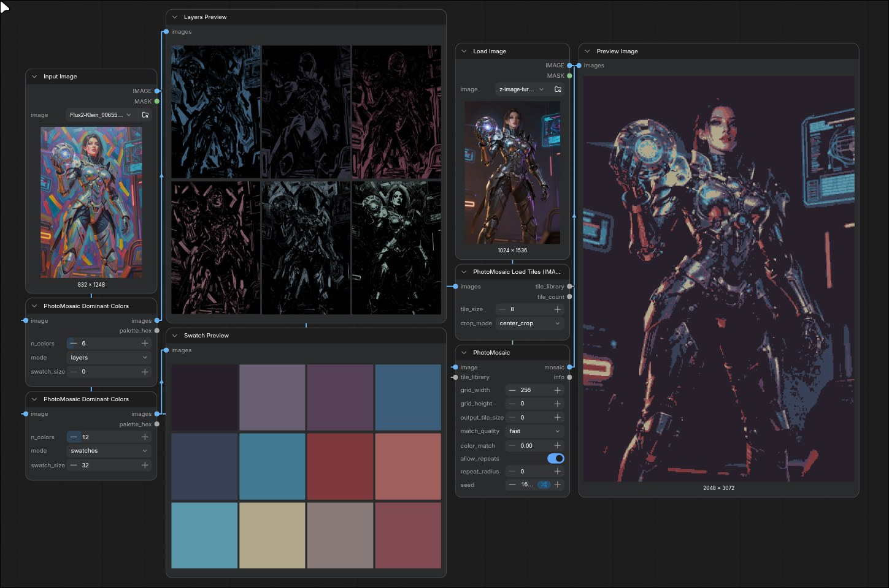

# ComfyUI-PhotoMosaic

ComfyUI nodes that turn an image into a **photomosaic** — a grid of
tile images chosen so their colours approximate the source. Point at a folder
of images (your saved Discord avatars, a screenshot dump, anything) and rebuild
a logo or photo out of them.



## Nodes

- **PhotoMosaic Load Tiles (Directory)** — scans a folder, square-crops/resizes
  every image to `tile_size`, and emits a `tile_library`. Also returns a small
  preview grid so you can sanity-check what was loaded.
- **PhotoMosaic Load Tiles (IMAGE Batch)** — same, but builds the library from
  any upstream `IMAGE` batch instead of a directory.
- **PhotoMosaic** — takes an `IMAGE` plus a `tile_library` and produces the
  mosaic `IMAGE`.
- **PhotoMosaic Dominant Colors** — extract the top N colours from an image
  via median-cut quantization. Two output modes: `swatches` (N solid-fill
  frames, frequency-ordered) or `layers` (N frames each isolating one
  cluster). Useful for generating a palette as an IMAGE batch, or as the
  input to a mosaic.

## Quick start

```
[Load Image]                                ┐
                                            ├──> [PhotoMosaic] ──> [Save Image]
[PhotoMosaic Load Tiles (Directory)]        ┘
   directory = /path/to/avatars
   tile_size = 64
```

A 1024×1024 source with `grid_width = 80`, `output_tile_size = 32` produces a
2560×2560 mosaic.

## Inputs that matter

- **`grid_width`** — how many tiles across. Higher = more detail, more tiles
  needed in the library, slower. 60–120 is a good range.
- **`output_tile_size`** — pixel size of each tile in the output. Bigger
  tiles mean each individual face/avatar is recognisable.
- **`match_quality`**
  - `fast` — match on a single mean colour per tile. Fine for most cases.
  - `quadrant` — match on four quadrant means (TL, TR, BL, BR). Better at
    keeping edges and structure.
- **`color_match`** — `0.0` keeps tile colours pristine; higher values shift
  each tile toward its target cell colour. `0.2`–`0.4` is a nice middle ground
  when the library doesn't cover the full colour range of the source.
- **`allow_repeats` / `repeat_radius`** — turn off repeats for a "every avatar
  used at most once" look, or set a radius to keep duplicates from clumping.
- **`crop_mode`** (loader) — `center_crop` keeps the centre of each tile;
  `fit` letterboxes the whole image onto a square (good for varied aspect
  ratios where you don't want to cut faces off).

## How it works

1. Each tile is square-cropped, resized to `tile_size`, and tagged with its
   mean RGB (and optionally per-quadrant mean RGB).
2. The source is resized to `grid_width × grid_height` to read each cell's
   colour signature in one shot.
3. For each cell, the nearest tile by squared L2 distance in colour space is
   chosen — vectorised over all cells at once.
4. Repeat constraints are applied greedily over a randomised cell order.
5. Tiles are pasted onto an output canvas; `color_match > 0` shifts each
   tile's mean toward its target cell colour while preserving its detail.

## Install

Drop this folder into `ComfyUI/custom_nodes/` and restart. The only deps are
`numpy`, `Pillow`, and `torch`, all of which ComfyUI already ships.
